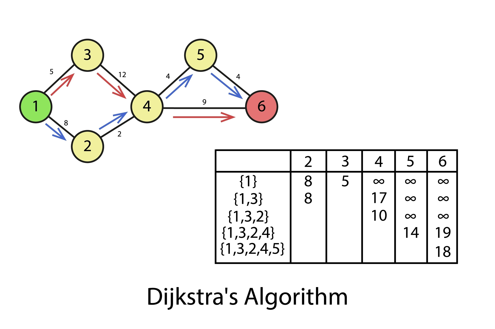

# 🚀 Project: Smart Logistics Routing API

## 📝 Overview

This project is a RESTful API designed to solve a core computer science and logistics problem: **finding the most efficient path** between locations on a predefined network (a **Graph**). The goal is to build a robust, production-ready backend service that accepts route constraints and returns optimal routing solutions.

This project was specifically designed to target **TypeScript** and modern backend frameworks (e.g., NestJS, Fastify, Hono).

## ✨ Key Technical Objectives

Successful completion of this project requires demonstrating proficiency in the following backend domains:

1.  **RESTful API Design:** Implement the requested endpoints.
2.  **Algorithm Implementation:** Implementing a complex graph traversal algorithm.
3.  **Type Safety & Structure:** Utilizing TypeScript to enforce strict contracts across the entire application.
4.  **API Documentation:** Generating industry-standard documentation (OpenAPI/Swagger) directly from the codebase.

## ⚙️ Technology Stack

| Component | Technology | Reasoning |
| :--- | :--- | :--- |
| **Language** | **TypeScript** | Required for type safety and advanced structure. |
| **Database** | **MongoDB** | To persist the network data (Nodes, Edges, Weights). |
| **Testing** | **Jest** | Required for comprehensive unit testing of the core algorithm logic. |
| **Documentation** | Auto-generation of OpenAPI Specification from code. |

## 📐 Project Endpoints

The API will expose two main sets of functionality: **Network Management** (CRUD for the Graph) and **Route Calculation** (the core algorithm).

### 1. Network Management Endpoints

| HTTP Method | Endpoint | Description | Body Example |
| :--- | :--- | :--- | :--- |
| **POST** | `/network/upload` | Uploads a new graph definition (Nodes and Edges) and return the ID of the graph. | `{"edges":[{"from":"A","to":"B","cost":10},{"from":"A","to":"C","cost":5},{"from":"B","to":"D","cost":8},{"from":"C","to":"D","cost":12},{"from":"D","to":"E","cost":12},{"from":"D","to":"F","cost":4},{"from":"F","to":"G","cost":4},{"from":"E","to":"G","cost":9},{"from":"C","to":"H","cost":8},{"from":"D","to":"H","cost":4},{"from":"F","to":"H","cost":1}]}` |
| **GET** | `/network/nodes/{id}` | Retrieves all defined nodes/locations from. | *None* |

### 2. Route Optimization Endpoint

| HTTP Method | Endpoint | Description | Core Requirement | Body Example | Suggested Response |
| :--- | :--- | :--- | :--- | :--- | :--- |
| **POST** | `/route/optimize/{id}` | Calculates the optimal path between two points returning the cost and the route that should be taken (e.g A -> C -> D -> E). | **Must implement the algorithm.** | `{"originNodeId": "A","destinationNodeId":"E"}` | `{"graphId":"uuid-123","totalCost":25.5,"path":["A","C","D","E"],"durationMs":4}` |
| **GET** | `/docs` | Serves the generated **Swagger UI**. | **Must be auto-generated.** | *None* | *None* |

## 🧠 The Core Algorithm Challenge

The primary challenge lies in implementing the logic for the `/route/optimize` endpoint.

### Algorithm Requirement
The backend service must implement **Dijkstra's Algorithm** or **A\* Search** to find the shortest path between the `originNodeId` and the `destinationNodeId`.


### Image of Dijkstra Algorithm Graph



### Complex Scenarios
The algorithm must be able to handle request bodies that include dynamic constraints:

1.  **Preference Switching:** The endpoint must accept a `preference` (e.g., `"shortest"`, `"fastest"`) and change the weight used in the calculation accordingly (e.g., using distance cost vs. time cost).
2.  **Constraint Filtering:** If the request specifies `constraints: { "avoidHighways": true }`, the algorithm must **temporarily ignore** or assign infinite cost to any edge tagged as a "highway," forcing a compliant, potentially longer route.
3.  **Error Handling:** Gracefully handle cases where the destination is unreachable or the input nodes are invalid (return `404 Not Found` or `400 Bad Request`).

That's a very common and professional way to handle a take-home project! It sets a clear, modern workflow expectation.

Here is the updated section to insert into the **Submission Checklist** of the `README.md` for the **Smart Logistics Routing API** (Project C).

---

## ✅ Submission Checklist & Workflow

A successful submission should include:

* [ ] Complete source code for the REST API.
* [ ] A working implementation of **Dijkstra's Algorithm** within a service layer.
* [ ] Clear **TypeScript Interfaces** for `Node`, `Edge`, and the various Request DTOs.
* [ ] Unit tests using **Jest** for the core routing algorithm (i.e., testing the function that calculates the path directly).
* [ ] Proof that the Swagger documentation is accessible and accurately reflects all endpoints and data schemas.

### 💻 Submission Workflow

The expected delivery method for this project is as follows:

1.  **Fork this Repository:** Create a private fork of the original project repository (or create a new private repository if the project was provided as a zip/template).
2.  **Develop:** Complete all required features and tests within your private repository.
3.  **Invite:** Once development is complete, **invite the hiring manager/recruiter** (or specific email address, e.g., `[Insert Reviewer Email Here]`) as a **Collaborator** to your private repository.
4.  **Notification:** Notify the reviewer that the code is ready and providing the link to the repository or perform an invitation to your repository.

***Please DO NOT submit the code as a zip file or a Pull Request (PR) to the original repository.*** This process allows us to review your commit history and development workflow directly.

---

## 🛠️ Local Setup, Run & Test Guide

### 1. Requirements

| Tool        | Version           | Notes                                                                 |
| :---------- | :---------------- | :-------------------------------------------------------------------- |
| **Node.js** | `>= 20.x`         | LTS recommended. Check with `node -v`.                                |
| **npm**     | `>= 10.x`         | Bundled with Node 20+. (`pnpm`/`yarn` also work.)                     |
| **MongoDB** | `>= 6.x`          | A reachable instance — local, Docker, or Atlas.                       |
| **Git**     | any recent        | To clone the repo.                                                    |
| **Docker**  | *(optional)*      | Only if you prefer running MongoDB and/or the API in containers.      |

### 2. Step-by-step Setup

```bash
# 1. Clone
git clone https://github.com/moonahmed786/smart-logistics-api.git
cd smart-logistics-api

# 2. Install dependencies
npm install

# 3. Create your local env file from the template
cp .env.example .env

# 4. Start MongoDB (pick ONE)
#    a) Local install:
#       brew services start mongodb-community   # macOS
#       sudo systemctl start mongod             # Linux
#    b) Docker one-liner:
#       docker run -d --name mongo -p 27017:27017 mongo:7
#    c) MongoDB Atlas: paste your connection string into MONGODB_URI in .env
```

### 3. Environment Variables (`.env`)

| Variable              | Default                                       | Purpose                                                  |
| :-------------------- | :-------------------------------------------- | :------------------------------------------------------- |
| `NODE_ENV`            | `development`                                 | Runtime mode.                                            |
| `PORT`                | `3000`                                        | HTTP port the API listens on.                            |
| `LOG_LEVEL`           | `info`                                        | Pino log level (`trace`/`debug`/`info`/`warn`/`error`).  |
| `MONGODB_URI`         | `mongodb://localhost:27017/smart_logistics`   | **Required.** Mongo connection string.                   |
| `MAX_GRAPHS`          | `5`                                           | LRU cap on stored graphs.                                |
| `API_KEY`             | *(empty)*                                     | If set, clients must send `x-api-key: <value>` header.   |
| `CORS_ORIGIN`         | `*`                                           | CORS allow-list.                                         |
| `RATE_LIMIT_TTL_MS`   | `1000`                                        | Throttle window. Default 1s.                             |
| `RATE_LIMIT_MAX`      | `5`                                           | Max requests per window per IP. Default 5 req/s (DoS protection). |
| `BODY_LIMIT_BYTES`    | `1048576`                                     | Max upload body size (bytes).                            |
| `DIJKSTRA_TIMEOUT_MS` | `500`                                         | Hard wall-clock cap on a single `optimize()` call.       |

### 4. How to Run

```bash
# Dev mode (hot reload)
npm run start:dev

# Production build + run
npm run build
npm run start:prod
```

On success you'll see Nest bootstrap logs, then the server listens on `http://localhost:3000`.

**Run with Docker (optional):**

```bash
docker build -t smart-logistics-api .
docker run --rm -p 3000:3000 --env-file .env smart-logistics-api
```

### 5. How to Test

```bash
# Unit tests (Jest)
npm test

# Watch mode
npm run test:watch

# Coverage report (outputs to ./coverage)
npm run test:cov

# End-to-end tests
npm run test:e2e
```

### 6. How to Interact with the System

**a) Swagger UI (easiest)**

Open `http://localhost:3000/docs` in your browser — you can try every endpoint directly from the UI.

**b) `curl` examples**

> If `API_KEY` is set in `.env`, append `-H "x-api-key: <your-key>"` to every request below.

```bash
# 1) Upload a network — returns { "id": "<graphId>" }
curl -X POST http://localhost:3000/network/upload \
  -H "Content-Type: application/json" \
  -d '{
    "edges": [
      {"from":"A","to":"B","cost":10},
      {"from":"A","to":"C","cost":5},
      {"from":"B","to":"D","cost":8},
      {"from":"C","to":"D","cost":12},
      {"from":"D","to":"E","cost":12}
    ]
  }'

# 2) List nodes for that graph
curl http://localhost:3000/network/nodes/<graphId>

# 3) Find the optimal route
curl -X POST http://localhost:3000/route/optimize/<graphId> \
  -H "Content-Type: application/json" \
  -d '{"originNodeId":"A","destinationNodeId":"E"}'
# → { "graphId":"...", "totalCost": 25, "path":["A","C","D","E"], "durationMs": 4 }
```

**c) HTTP clients**

Import the OpenAPI spec from `http://localhost:3000/docs-json` into Postman / Insomnia / Bruno to get a ready-made collection of all endpoints.

### 7. Troubleshooting

| Symptom                                  | Likely cause / fix                                                       |
| :--------------------------------------- | :----------------------------------------------------------------------- |
| `MongooseServerSelectionError`           | Mongo not running or `MONGODB_URI` is wrong. Verify with `mongosh`.      |
| `401 Unauthorized`                       | `API_KEY` is set but the request is missing the `x-api-key` header.      |
| `EADDRINUSE` on startup                  | Port `3000` already in use. Change `PORT` in `.env`.                     |
| `429 Too Many Requests`                  | Hit the per-IP throttle. Raise `RATE_LIMIT_MAX` or wait the TTL.         |
| `400 Bad Request` on `/network/upload`   | Body exceeds `BODY_LIMIT_BYTES` or fails DTO validation — check shape.   |
